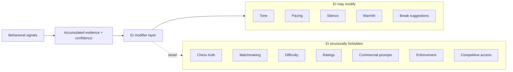

# ACCL Emotional Intelligence Doctrine

> **DO NOT BUILD YET**  
> This document is **doctrine and specification preservation only**. It does not authorize runtime logic, schema, APIs, UI surfaces, or model integrations until a future phase is explicitly approved.

**Lock type:** Anti-pattern preservation + architectural containment rules.  
**Lock snapshot:** `docs/phase-locks/ACCL_EI_DOCTRINE_LOCK.md`

---

## Purpose

Preserve the architectural rule that **Emotional Intelligence (EI) is modifier infrastructure, not authority infrastructure**.

EI may influence *how* the platform communicates and paces support. EI must never become a hidden decision-maker for competitive truth, access, or outcomes.

---

## Architectural role

| Role | EI | Authority systems (examples) |
|------|----|----------------------------|
| **May** | Modify tone, pacing, silence, warmth, break suggestions | — |
| **Must not** | — | Chess truth, matchmaking, difficulty, ratings, commercial prompts, enforcement, competitive access |

**Modifier infrastructure:** adjusts presentation and cadence within fixed policy bounds.  
**Authority infrastructure:** changes what is true, who plays whom, what is allowed, or what is owed.

EI sits downstream of authority. It does not override it.

---

## Containment principle

In containment-oriented architecture, the most important diagram is not only what the system **can** do, but what the system is **structurally forbidden** from doing.

Forbidden paths are not “disabled by config.” They are **out of scope** for the EI module’s contract.

---

## ANTI-PATTERN: Single-Event Emotional Inference

### Definition

Any system that infers a user’s emotional state from **one isolated behavioral event** and **acts on it immediately** is architecturally unsafe.

Examples of unsafe behavior (non-exhaustive):

- One rapid resign → “You seem frustrated; here’s a harder opponent.”
- One blunder → “You look tilted; reducing difficulty.”
- One long pause → “You seem anxious;” escalating commercial or social prompts.
- One chat tone flag → immediate warmth or silence change with no corroboration.

### Why it is forbidden

- Creates **false positives** (misreads normal play as emotion).
- Makes users feel **watched** or profiled from a single moment.
- Causes **sensitivity creep** (thresholds drift toward overreaction).
- Invites **engagement optimization pressure** (treat emotion as a conversion lever).
- **Weakens trust** in a competitive platform where stakes matter.
- Risks **emotional manipulation** when responses are disproportionate to evidence.

### Correct pattern

Emotional state inference must use:

1. **Accumulated evidence** — multiple observations over time, not one event.
2. **Confidence scoring** — explicit uncertainty; low confidence → no action or minimal action.
3. **Signal corroboration** — independent signal families must agree before stronger modifiers apply.
4. **Decay over time** — stale emotional hypotheses expire; recent behavior weighs more.
5. **Proportional response thresholds** — stronger tone/pacing changes require higher confidence and more corroboration.

**Default when uncertain:** neutral tone, standard pacing, no special break or warmth escalation.

---

## Parallel: Integrity Layer suspicion model

EI emotional inference mirrors the Integrity Layer’s **suspicion scoring** model:

| Integrity (anti-abuse) | Emotional Intelligence (support modifier) |
|------------------------|-------------------------------------------|
| Never convict from one signal | Never infer emotion from one event |
| Accumulate weighted evidence | Accumulate behavioral + contextual evidence |
| Decay stale signals | Decay stale emotional hypotheses |
| Require corroboration before escalation | Require corroboration before stronger modifiers |

Reference: `docs/security/ACCL_9_LAYER_ANTI_CHEAT_ARCHITECTURE.md` — event ledger, overlap/suspicion evaluation, enforcement gating (`lib/analysis/intelligence.ts` patterns).

**Shared rule:** one signal is a hint; action requires a scored, decaying, corroborated model.

---

## Hard rule (non-negotiable)

### EI may modify

- Tone (word choice, directness, encouragement level within policy)
- Pacing (when to surface tips, when to stay quiet)
- Silence (withhold non-essential prompts)
- Warmth (supportive framing without falsifying outcomes)
- Break suggestions (optional rest prompts; never mandatory lockouts)

### EI may never alter

- **Chess truth** — engine lines, evaluations, legality, game result semantics
- **Matchmaking** — pairing, queue priority, opponent selection
- **Difficulty** — bot level, training depth, adaptive challenge curves tied to “emotion”
- **Ratings** — Elo, buckets, provisional status, rating application
- **Commercial prompts** — upsell, deposit, subscription pressure keyed to inferred mood
- **Enforcement** — flags, restrictions, anti-cheat escalation
- **Competitive access** — tournament entry, rated eligibility, seat assignment

If a proposed feature requires any forbidden column, it is **not an EI feature** — it belongs to another subsystem with its own governance, or it is rejected.

---

## Implementation status

| Item | Status |
|------|--------|
| Doctrine / anti-patterns | **This document** |
| Runtime EI logic | **Not started** |
| Schema / APIs / UI | **Not authorized** |

Do not implement EI until a future phase explicitly unlocks build work and references this doctrine as the contract baseline.

---

## Related documentation

- `docs/security/ACCL_9_LAYER_ANTI_CHEAT_ARCHITECTURE.md` — integrity, suspicion, enforcement containment
- `docs/security/SUPABASE_SECURITY_BASELINE.md` — service-role and data-boundary containment
- `docs/design/ACCL_DESIGN_DIRECTION_V1.md` — presentation layer; must not imply authority EI lacks

---

*This file is the Emotional Intelligence doctrine lock for anti-pattern preservation. Treat it as the baseline before any EI implementation phase.*
