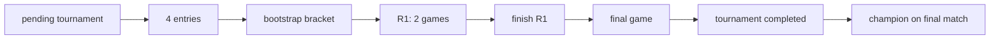

# Phase 1 — Tournament Hardening: 4-player manual KO verification

**Scope:** Prove the **existing** single-elimination path only. No Swiss, no async bot queue, no new product features.

## Flow under test



| Step | Mechanism |
|------|-----------|
| Registration | `tournament_entries` (ops `add-entrants` or free join while pending) |
| Bracket | `persistTournamentBracket` / `POST /api/internal/tournaments/bootstrap-bracket` |
| R1 games | DB `tournament_bootstrap_round` → `tournament_try_spawn_game` |
| Advancement | Trigger `trg_games_tournament_finish_advance` → `tournament_handle_finished_game` |
| Champion | `tournament_propagate_winner` on final → `tournaments.status = completed` |

## Preconditions

- Migrations applied through `20260515180000_tournament_try_spawn_game_ecosystem_scope.sql` (or later).
- Four distinct `profiles.id` UUIDs available.
- `.env.local`: `NEXT_PUBLIC_SUPABASE_URL`, `SUPABASE_SERVICE_ROLE_KEY`.

## Automated verification (preferred)

```bash
node scripts/tournament-4p-ko-verification.mjs
```

Optional:

- `PHASE_1_4P_PLAYER_IDS=<uuid1>,<uuid2>,<uuid3>,<uuid4>` — seed order (best → worst). Default: bot IDs from env + profiles table.
- `TOURNAMENT_4P_KEEP=1` — leave tournament rows for manual inspection.

**Pass criteria:** script exits 0 and prints `Phase 1 — 4-player KO verification PASSED`.

## Manual operator path (HTTP)

Requires `ACCL_TOURNAMENT_OPS_SECRET` and running app (`ACCL_BASE_URL`).

1. `POST /api/internal/tournaments/create` — `pending`, `format: single_elimination`
2. `POST /api/internal/tournaments/add-entrants` — 4 `user_ids` (before any `tournament_matches`)
3. `POST /api/internal/tournaments/bootstrap-bracket` — `ordered_user_ids` permutation of entrants
4. Confirm 2 R1 `game_id`s on snapshot / DB
5. Finish each game (checkmate or `finish_game_system` with `white_win` / `black_win`)
6. Confirm final `game_id`, then champion; `tournaments.status = completed`

## Unit coverage (planner only)

`tests/unit/tournamentFoundation.spec.ts` — N=4 advancement simulation (no DB).

Does **not** replace the integration script above.

## Out of scope (Phase 1)

- Paid entry / webhook registration races (separate registration gate work)
- Tournament + free-play coexistence banners
- Swiss format
- Bot/tournament automation

## Failure triage

| Symptom | Likely cause |
|---------|----------------|
| `Matches exist while tournament still pending` | Bracket half-written; delete `tournament_matches` or repair status |
| R1 missing `game_id` | `tournament_try_spawn_game` / migration not applied |
| Final not spawned after R1 | `trg_games_tournament_finish_advance` missing or game not `finished` |
| `tournament_advance_invariant_violation` | Bracket plan vs DB `advance_winner_as` mismatch |
| Stays `active` after final | Winner not derived (`result` / `winner_id` on game) |

## Related

- Next slice: [PHASE_1_TOURNAMENT_8P_KO_VERIFICATION.md](./PHASE_1_TOURNAMENT_8P_KO_VERIFICATION.md)
- No-show / manual ops: [PHASE_1_TOURNAMENT_NOSHOW_OPS.md](./PHASE_1_TOURNAMENT_NOSHOW_OPS.md)
