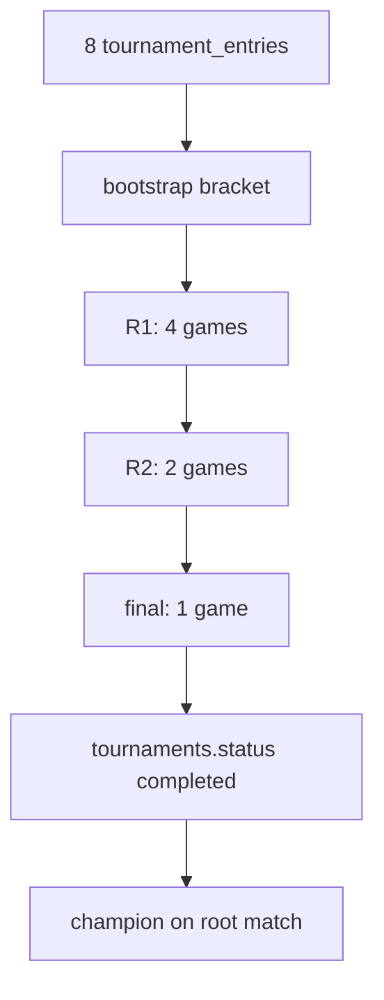

# Phase 1 — Tournament Hardening: 8-player manual KO verification

**Scope:** Prove the **existing** single-elimination path for a full 8-bracket (no byes). Same constraints as [4-player verification](./PHASE_1_TOURNAMENT_4P_KO_VERIFICATION.md).

## Bracket shape (8 entrants, no padding)

| Round | Matches | Games (both seated) |
|-------|---------|------------------------|
| 1 | 4 | 4 |
| 2 | 2 | 2 |
| 3 (final) | 1 | 1 |
| **Total** | **7** | **7** |

Pairings (seed order): 1v8, 2v7, 3v6, 4v5 → standard `firstRoundPairings` / `planSingleEliminationBracket`.

## Flow under test



## Automated verification

```bash
npm run verify:tournament-8p-ko
# or
node scripts/tournament-8p-ko-verification.mjs
```

Optional:

- `PHASE_1_8P_PLAYER_IDS=<8 comma-separated UUIDs>` — seed order (best → worst). Default: `BOT_USER_ID_*` + `profiles`; auto-provisions one-off auth/profile rows if the DB has fewer than eight.
- `TOURNAMENT_8P_KEEP=1` — leave rows for inspection

Playwright (loads `.env.local`):

```bash
PLAYWRIGHT_SKIP_WEBSERVER=1 npx playwright test --project=integration-db tests/integration/tournament8pKoVerification.spec.ts
```

**Pass criteria:** `Phase 1 — 8-player KO verification PASSED`

## Verified invariants

- Exactly **8** `tournament_entries`
- **7** `tournament_matches` after bootstrap
- Each round has expected **game_id** count before finishes
- `finish_game_system` + trigger advances feeders; next round games spawn
- Root match (`next_match_id` null) `winner_id` = champion
- `tournaments.status` → `completed`

## Out of scope

Swiss, tournament bots, async bot queue, auto-forfeit, payouts, registration-gate UX, new bracket architecture.

## Failure triage

| Symptom | Boundary |
|---------|----------|
| Script fails before tournament create | Entrant resolution (`PHASE_1_8P_PLAYER_IDS`, `BOT_USER_ID_*`, profiles, or service-role auth provision) |
| Fewer than 7 matches | `persistTournamentBracket` / planner |
| R1 ≠ 4 games | `tournament_bootstrap_round` / `tournament_try_spawn_game` |
| R2 not spawned after R1 | `tournament_handle_finished_game` / `tournament_propagate_winner` |
| Final not spawned after R2 | same; check `tournament_process_bye_or_spawn` on R2+ |
| Stays `active` | final game finish / `tournament_winner_from_game` |

## Related

- Prior slice: [PHASE_1_TOURNAMENT_4P_KO_VERIFICATION.md](./PHASE_1_TOURNAMENT_4P_KO_VERIFICATION.md)
- No-show / manual ops: [PHASE_1_TOURNAMENT_NOSHOW_OPS.md](./PHASE_1_TOURNAMENT_NOSHOW_OPS.md)
- Unit planner: `tests/unit/tournamentFoundation.spec.ts` (N=8 match count)
