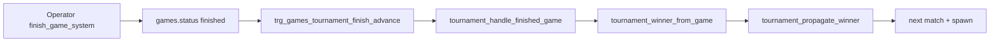

# Phase 1 — Tournament no-show / missing-player operational boundary

**Scope:** Document and verify **current** behavior when a player cannot play, does not show, or a bracket game cannot complete normally. **No** auto-forfeit product, Swiss, tournament bots, payouts, or bracket redesign.

## Answers (verified 2026-05)

| # | Question | Current behavior |
|---|----------|------------------|
| 1 | Can the bracket continue if one player is absent? | **Yes, after manual game resolution** — both slots are seated at spawn; an absent player leaves the `games` row `active`. Operator (service role) must call `finish_game_system` with `white_win` or `black_win` for the **present** player. **No** auto-advance on empty slots after round 1 (only structural R1 byes). **Draw** does not advance (`tournament_winner_from_game` → null). |
| 2 | What manual operator action exists today? | **Supabase service role:** `finish_game_system(p_game_id, 'white_win' \| 'black_win', p_end_reason)` with **`p_end_reason` in the DB allow-list** (`resign`, `timeout`, `draw_agreement`, `checkmate`, `stalemate`, … — **not** free text; `forfeit` / `no_show` are rejected by `games_end_reason_check`). MVP: use **`timeout`** or **`resign`** as the stored label when awarding the present player. **HTTP ops** (secret header): create tournament, add entrants, bootstrap bracket only — **no** finish-game route. **In-app:** seated player may **Resign** (`finish_game` → opponent wins); that awards the **opponent**, not a no-show default to the present player. |
| 3 | Can `finish_game_system` safely advance the present player? | **Yes** — same RPC path as KO verification; `end_reason` is stored but **not** read by advancement (only `result` / `winner_id`). |
| 4 | Does `tournament_handle_finished_game` propagate correctly? | **Yes** — trigger `trg_games_tournament_finish_advance` on `games.status` → `finished` calls `tournament_winner_from_game` then `tournament_propagate_winner` (sets `winner_id`, eliminates loser, feeds next match, spawns next game). |
| 5 | Does the tournament complete if no-shows are manually resolved? | **Yes** — when every required match has a decisive finish (`white_win` / `black_win`), the final root match sets `tournaments.status = completed`. |
| 6 | MVP manual ops UX understandable enough? | **Partial** — snapshot/board uses `matchBoardStatus`: Waiting / Ready / **In progress** / Resolved; tournament status Pending / Active / Completed. **`end_reason` is not exposed** on tournament snapshot; no “forfeit” or “no-show” chip. Operators should record reason in external runbook + DB `games.end_reason`. |

## Manual operator runbook (MVP)

Prerequisites: `SUPABASE_SERVICE_ROLE_KEY`, tournament `active`, match has `game_id`.

1. Identify the **present** player and their color on the bracket game (`games.white_player_id` / `black_player_id`).
2. In SQL editor or script:

```sql
select public.finish_game_system(
  '<game_id>'::uuid,
  'white_win',  -- or black_win for the present player
  'timeout'     -- must be allow-listed (e.g. timeout, resign); not interpreted by advancement
);
```

3. Confirm `tournament_matches.winner_id` on that row, next-round `game_id` spawned when both feeders resolved.
4. Repeat until root match has `winner_id` and `tournaments.status = completed`.

**Do not use `draw`** for no-show resolution — advancement will not run.

**Wrong-direction shortcut:** asking the **present** player to resign awards the **absent** player; use service-role finish toward the present player instead.

## What does *not* happen automatically

| Situation | Behavior |
|-----------|----------|
| Player never opens board | Game stays **In progress** until manual finish |
| One feeder match ends in draw | `winner_id` stays null; sibling feeder may advance; **final does not spawn** until that match is decisively finished |
| Missing `player2_id` in round 2+ | `tournament_process_bye_or_spawn` **waits** (not a bye) |
| Clock / timeout | No tournament-specific auto-forfeit in scope |

## DB boundaries (reference)



- `tournament_winner_from_game`: `winner_id`, else `white_win` / `black_win` → seated player id; else null.
- `enforce_tournament_finality`: finished tournament games cannot reopen or change result/end_reason.

## Automated verification

```bash
npm run verify:tournament-noshow-ops
# or
node scripts/tournament-noshow-ops-verification.mjs
```

Optional: `TOURNAMENT_NOSHOW_KEEP=1` — leave rows for inspection.

**Pass criteria:** `Phase 1 — tournament no-show ops verification PASSED`

Covers:

- Draw on one R1 game → no `winner_id`, tournament not completed, final not spawned.
- R1 + final resolved via `finish_game_system` with allow-listed reasons (`resign`, `timeout`) → propagation + `completed`.

## Failure triage

| Symptom | Boundary |
|---------|----------|
| `finish_game_system` fails | `finish_game_core` (game not active, invalid result) or **`games_end_reason_check`** (custom `forfeit` / `no_show` strings) |
| Game finished, match `winner_id` null | `tournament_handle_finished_game` / draw result / non-tournament `play_context` |
| Winner set, next game missing | `tournament_propagate_winner` / `tournament_try_spawn_game` / tournament not `active` |
| Stays `active` after final finish | final game not decisive or trigger missing |
| Present player resigned, wrong winner | operator used client resign instead of service-role award to present player |

## Out of scope (locked)

Auto-forfeit, Swiss, tournament bots, async bot queue, payout logic, reconnect authority, new ops HTTP finish endpoint, snapshot UX for `end_reason`.

## Related

- [PHASE_1_TOURNAMENT_4P_KO_VERIFICATION.md](./PHASE_1_TOURNAMENT_4P_KO_VERIFICATION.md) — happy-path KO + manual finish note
- [PHASE_1_TOURNAMENT_8P_KO_VERIFICATION.md](./PHASE_1_TOURNAMENT_8P_KO_VERIFICATION.md)
- [PHASE_1_TOURNAMENT_SCHEDULED_START_NOSHOW.md](./PHASE_1_TOURNAMENT_SCHEDULED_START_NOSHOW.md) — `starts_at` + grace boundary
