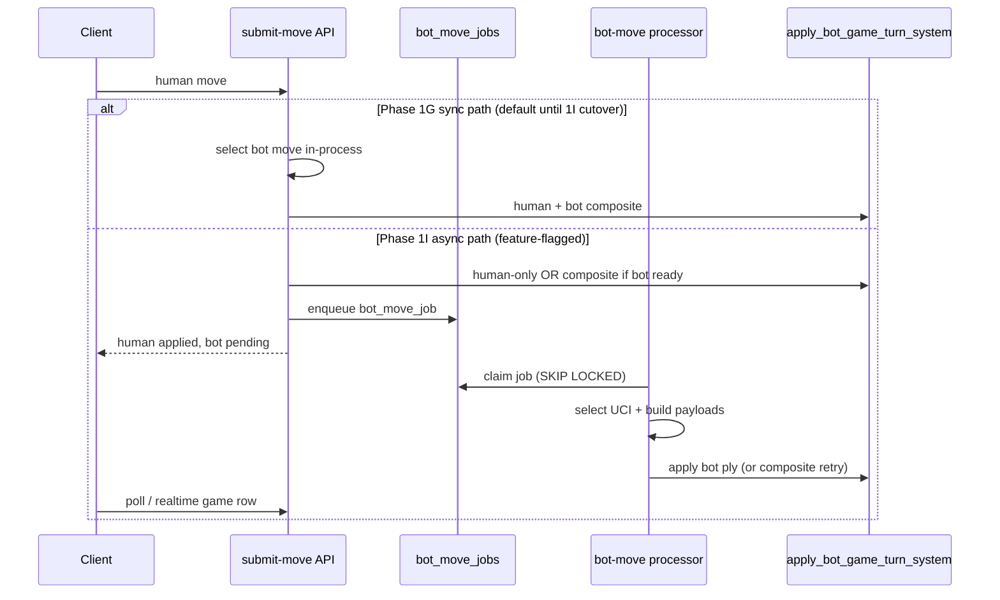

# Phase 1I Plan — `bot_move_jobs` Queue Architecture

> **1I-a implemented (infra only, flag OFF).** See `docs/phase-locks/PHASE_1IA_BOT_MOVE_JOBS_INFRA_LOCK.md`.  
> **1I-b+ not started** — no submit-move cutover, no shadow enqueue, no processor route.

**Prerequisite locks:** 1E (transactional move logs), 1F (idempotency), 1G (`apply_bot_game_turn_system`), 1H (`games.bot_settings`).

**Out of scope for 1I:** EI, encyclopedia, battlefield, cosmetics, external chess pipelines, computer-play UX polish (Phase 1I-B candidate).

---

## 1) Problem statement

Today, bot move **selection** runs synchronously inside `submit-move` (`lib/server/submitMoveBotGameCommit.ts`) before the composite RPC commits human + bot plies. That is correct for **transactional integrity** (Phase 1G) but creates pressure to:

- Block the HTTP request on candidate generation + think time
- Retry bot selection inside the same request on partial failures
- Scale poorly if bot engines become heavier (external engine, deeper search)

**Goal of 1I:** Introduce an **async job queue** for bot move *work* without breaking the authoritative commit model.

---

## 2) Design principles

| Principle | Rule |
|-----------|------|
| **Authority unchanged** | `apply_bot_game_turn_system` remains the only commit path for bot-game plies + logs |
| **Human ply first** | Human move may commit in-request; bot ply may be deferred only with explicit UX contract |
| **Idempotency preserved** | Job rows carry deterministic keys aligned with Phase 1F move-log idempotency |
| **No partial bot state** | Never leave “human applied, bot pending” without a recoverable job + client polling contract |
| **Service-role only** | Queue tables/RPCs follow `finished_game_analysis_jobs` containment pattern |

---

## 3) Proposed architecture (target state)

**Recommended 1I scope:** schema + RPCs + internal processor + feature flag — **not** full client UX overhaul.

---

## 4) Data model (draft)

### Table: `public.bot_move_jobs`

| Column | Type | Notes |
|--------|------|-------|
| `id` | `uuid` PK | |
| `game_id` | `uuid` FK → `games` | |
| `status` | `text` | `queued` \| `running` \| `completed` \| `failed` \| `cancelled` |
| `post_human_fen` | `text` | FEN after human ply (bot selection input) |
| `bot_player_id` | `uuid` | Seat to move |
| `idempotency_key` | `text` | Matches bot move-log key (`mv:…`) |
| `selected_uci` | `text` null | Filled by worker |
| `think_ms` | `int` null | Display / log duration |
| `attempt_count` | `int` default 0 | |
| `last_error` | `text` null | |
| `correlation_id` | `text` null | Trace submit → worker |
| `created_at` | `timestamptz` | |
| `updated_at` | `timestamptz` | |
| `claimed_at` | `timestamptz` null | |
| `completed_at` | `timestamptz` null | |

**Indexes:**

- `(game_id, status)` — worker claim + game status UI
- **Unique** `(game_id, idempotency_key)` — dedupe retries
- `(status, created_at)` — FIFO claim

**RLS:** enabled; `service_role` only (mirror analysis jobs).

### Optional: `bot_move_job_attempts` (1I stretch)

Append-only attempt log for ops; defer if timeboxed.

---

## 5) RPCs / functions (draft)

| Function | Purpose |
|----------|---------|
| `enqueue_bot_move_job(...)` | Insert `queued` row; return job id; dedupe on `(game_id, idempotency_key)` |
| `claim_next_bot_move_job()` | `FOR UPDATE SKIP LOCKED` → `running` |
| `complete_bot_move_job(job_id, selected_uci, think_ms)` | Mark `completed` after RPC success |
| `fail_bot_move_job(job_id, error)` | Mark `failed` with `last_error` |
| `fail_stale_running_bot_move_jobs(stale_seconds)` | Ops recovery (mirror analysis queue) |
| `get_bot_move_job_for_game(game_id)` | Poll helper for client |

**Commit:** Worker calls existing `apply_bot_game_turn_system` with pre-built bot payload (or a slim `apply_bot_ply_only_system` only if composite idempotency proves awkward — prefer composite for fewer code paths).

---

## 6) Worker / processor

**Route (internal):** `POST /api/internal/bot-move-queue/process`  
**Auth:** shared secret header (same pattern as `ACCL_ANALYSIS_QUEUE_SECRET` or dedicated `ACCL_BOT_MOVE_QUEUE_SECRET`).

**Worker steps:**

1. Claim batch of `queued` jobs
2. Load game row + `bot_settings` (Phase 1H)
3. `verifyBotReplyPreconditions` + `buildBotCandidatesFromFen` + `selectBotMoveForStyle`
4. Build bot move-log payload + idempotency key
5. Call `apply_bot_game_turn_system` (human skip path / bot-only idempotent branch per 1G SQL)
6. Finalize job `completed` or `failed`

**Stale running:** cron marks `running` → `failed` after TTL; client may retry enqueue with same idempotency key.

---

## 7) Submit-move integration (phased cutover)

### Phase 1I-a (infra only)

- Migrations + RPCs + processor + ops endpoints
- Feature flag `BOT_MOVE_QUEUE_ENABLED=0` (default off)
- No change to production submit path

### Phase 1I-b (dual-write / shadow) — **plan only**

See `docs/plans/PHASE_1I_B_SHADOW_ENQUEUE_PLAN.md`.

- Enqueue job **after** successful sync composite (audit parity, non-blocking)
- Shadow rows `completed` with same UCI/idempotency as sync commit
- **Not started** — no code

### Phase 1I-c (async cutover — optional)

- Human commits; enqueue bot job; return `bot_move_applied: false`, `bot_move_pending: true`
- Client polls game row or subscribes via existing realtime
- **Requires** UX spec (spinner, “computer thinking”, stale recovery) — likely 1I-B / 1J

**1I recommendation:** ship **1I-a + 1I-b** only; defer **1I-c** until UX lock.

---

## 8) Idempotency & failure modes

| Scenario | Behavior |
|----------|----------|
| Duplicate submit | Existing 1F keys; job unique constraint no-ops |
| Worker crash mid-RPC | Transaction rolls back; job stays `queued` or retry `failed` |
| Human terminal (mate/resign) | No job enqueued |
| Stale FEN at worker | `optimistic_conflict`; job `failed`; client refresh |
| Bot already applied | 1G idempotent return; job `completed` |

---

## 9) Observability

- Structured logs: `game_id`, `job_id`, `correlation_id`, `status`, `attempt_count`
- Ops endpoint: queue depth, stale `running`, failed sample (mirror `analysis-queue/ops`)
- Smoke extension (future): enqueue → process → 4 plies still pass

---

## 10) Testing plan (when implemented)

| Test | Type |
|------|------|
| Migration SQL shape | Static |
| `enqueue` dedupe | Unit / DB |
| `claim` SKIP LOCKED concurrency | Integration |
| Worker + composite RPC happy path | Integration |
| Idempotent retry | Integration |
| Submit-move unchanged with flag off | Static + smoke |
| Phase 1E smoke still green | Script |

---

## 11) Deliverables checklist (build phase — not started)

- [ ] Migration: `bot_move_jobs` table + indexes + RLS
- [ ] RPCs: enqueue, claim, complete, fail, stale recovery
- [ ] Internal processor route + secret
- [ ] Ops runbook (`docs/BOT_MOVE_QUEUE_OPS_RUNBOOK.md`)
- [ ] Feature flag + shadow metrics (1I-b)
- [ ] Phase 1I lock snapshot after smoke

---

## 12) Explicit non-goals (1I)

- EI / emotional inference
- Changing PvP `apply_move_and_maybe_finish_system`
- External engine farm
- Matchmaking or rating side effects
- Removing sync bot path before shadow validation

---

## 13) References

- `lib/server/submitMoveBotGameCommit.ts` — current sync bot selection + composite RPC
- `supabase/migrations/20260531160000_apply_bot_game_turn_system.sql` — composite commit
- `supabase/migrations/20260406220000_finished_game_analysis_queue.sql` — queue pattern reference
- `docs/ANALYSIS_QUEUE_OPS_RUNBOOK.md` — ops/cron pattern
- `docs/phase-locks/PHASE_1H_BOT_SETTINGS_LOCK.md` — prerequisite storage lock

---

*Plan document only. No schema, routes, or workers until explicitly approved for implementation.*
