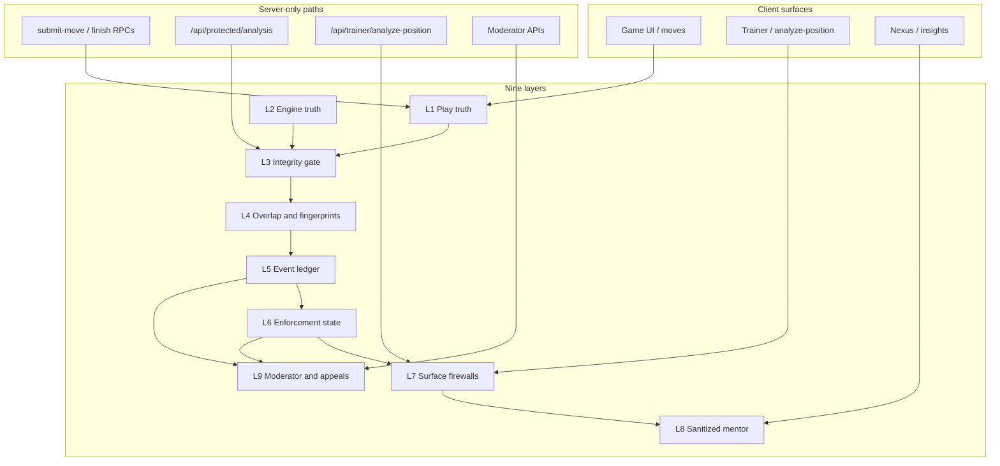

# ACCL 9-Layer Anti-Cheat Architecture (Specification)

> **DO NOT BUILD YET**  
> This document is a **specification and phased roadmap only**. It does not authorize schema changes, new API routes, or refactors until each phase is explicitly approved and sequenced after current security-hardening and operational milestones.

---

## Purpose

Define how ACCL prevents competitive integrity abuse (engine assistance, live-position probing, training-channel leakage) while preserving legitimate post-game review, Nexus teaching, and moderator governance.

The design aligns with existing platform boundaries:

| Principle | ACCL expression today |
|-----------|---------------------|
| **Engine = truth source** | Canonical move/position evaluation via Stockfish-backed analysis (`lib/analysis/engine.ts`, `getChessTruth` / `runEngineAnalysis` in `lib/analysis/intelligence.ts`). |
| **Integrity = gate / checkpoint** | Every intelligence response passes `evaluateIntegrityPolicy` and `getIntegrityControlledTruth` before callers see engine output (`lib/analysis/intelligence.ts`, `lib/analysis/protectedAnalysisServer.ts`). |
| **Adaptive Mentor = sanitized teaching layer** | Nexus and player-facing insight paths **read/sanitize/present only** (`lib/nexus/scopeBoundary.ts`, `sanitizeAnalysisRows`, `sanitizePlayerInsights`); advisory outputs are non-authoritative (`lib/nexus/contract.ts`). |
| **Trainer cannot expose active tournament analysis** | `assertTrainerAnalysisAllowed` blocks `ACTIVE_TOURNAMENT`, active PIT, and active-game paths (`lib/trainer/trainerAnalysisGuard.ts`); protected analysis rejects live tournament FEN (`runProtectedAnalysisRequest`). |
| **Enforcement tables = server-only** | `anti_cheat_enforcement_states`, `anti_cheat_enforcement_override_history` — RLS + `service_role` only (`20260530130000_supabase_security_rls_anti_cheat_and_moves.sql`, `lib/analysis/enforcementStore.ts`). |
| **Immutable moderator audit** | Append-only `moderator_queue_action_history`; role-change audit `moderator_role_audit_history`; enforcement overrides in `anti_cheat_enforcement_override_history`. |

---

## System context (high level)

---

## The nine layers

### Layer 1 — Play truth (authoritative game state)

**Role:** Single source of competitive reality: who is seated, whose turn, clock fields, terminal status, tournament binding.

**Existing anchors:**

- Tables: `public.games`, `public.game_move_logs`
- Server RPCs: `finish_game`, `create_seated_game_guard`, `apply_move` paths (see `supabase/migrations`, `app/api/game/submit-move`)
- RLS: participant-scoped read/write; tournament rows visible only to seated players (see `docs/security/SUPABASE_SECURITY_BASELINE.md`)

**Anti-cheat responsibility:**

- All suspicion and enforcement **must bind to `game_id`** when the request originates from a live or finished game.
- Clients must not be treated as integrity authorities; DB + RPC boundaries enforce seat and status.

**Gaps (spec targets, not build yet):**

- Move validation parity between client and server (noted in `docs/ACCL-RUNTIME-AUDIT-AND-TEST-PLAN.md`).

---

### Layer 2 — Engine truth source

**Role:** Expensive, high-fidelity evaluation (best move, candidates, depth) used **only** behind Layer 3.

**Existing anchors:**

- `getChessTruth`, `runEngineAnalysis`, `StockfishWebAdapter` (`lib/analysis/`)
- Modes: `IntelligenceMode` (`lib/analysis/modes.ts`)

**Anti-cheat responsibility:**

- Engine output is **never** a direct API response to browsers for protected contexts.
- Failures degrade to heuristic analysis or refusal, not silent bypass (`ChessTruthError`, `engine_unsanitizable_output`).

**Invariant:** Engine answers “what is true about this position?” — not “what may this user see?”

---

### Layer 3 — Integrity gate (policy checkpoint)

**Role:** Decides **response level** before any teaching payload is returned: `FULL` | `GUIDED` | `RESTRICTED` | `BLOCKED`.

**Existing anchors:**

- `IntegrityContext` / `IntegrityContextType` (`lib/analysis/intelligence.ts`)
- `evaluateIntegrityPolicy`, `getIntegrityControlledTruth`
- `resolveIntegrityContextFromGame` (`lib/analysis/protectedAnalysisServer.ts`)
- Refusal reasons: `active-tournament-game-protected`, `active-rated-game-protected`, `free-play-human-vs-human-consent-required`, overlap-related refusals

**Context matrix (current behavior):**

| Context | Typical response |
|---------|------------------|
| `active-tournament-game` | **BLOCKED** |
| `active-rated-game` | **BLOCKED** |
| `active-unrated-free-play-game` (HvH, no consent) | **BLOCKED** |
| `active-unrated-free-play-game` (consent) | **GUIDED** / **RESTRICTED** |
| `completed-game-review` | **FULL** (subject to overlap + enforcement) |
| `training-mode` | **FULL** (subject to overlap + enforcement) |

**Anti-cheat responsibility:**

- Canonical FEN check on active games: request FEN must match `games.fen` or request is rejected (`runProtectedAnalysisRequest`).
- All downstream layers assume gate output is final for that HTTP request.

---

### Layer 4 — Overlap, similarity, and position fingerprints

**Role:** Detect probing, book overlap, novelty collision, and confirmed overlap with live or protected material.

**Existing anchors:**

- `evaluateOverlap`, `OverlapVerdict`, suspicion scoring (`lib/analysis/intelligence.ts`)
- Tournament position capture: `protected_position_fingerprints` + trigger `record_tournament_position_fingerprint` (`20260426123000_tournament_enforcement_wall.sql`)
- Signals: `confirmed_overlap`, `protected_context_overlap_attempt`, `blocked_live_protected_request`, `repeated_probing`, etc. (`lib/analysis/antiCheatStore.ts`)

**Anti-cheat responsibility:**

- Protected live contexts multiply suspicion weight.
- Fingerprints are **metadata for server pipelines** (Nexus may read metadata only per `NEXUS_SCOPE_BOUNDARY`).

**Future (Phase 4):** Server-side move-timing features, engine-line similarity scoring beyond prefix collision — **not implemented in this spec’s code path yet**.

---

### Layer 5 — Anti-cheat event ledger (append-only signals)

**Role:** Durable, queryable stream of integrity incidents per user/game.

**Existing anchors:**

- Table: `public.anti_cheat_events` (RLS: `service_role` insert — `20260407170000_anti_cheat_rls_scaffold.sql`)
- Store: `SupabaseAntiCheatEventStore` (`lib/analysis/antiCheatStore.ts`)
- Fields: `overlap_verdict`, `suspicion_score`, `suspicion_tier`, `reasons_json`, `protected_context`, `engine_called`, `request_context`

**Anti-cheat responsibility:**

- Events are **facts for scoring and moderator review**, not user-facing sanctions.
- Rolling windows and trend (`computeRollingSuspicionTrendByUser`) inform Layer 6.

**Invariant:** Append-only from application perspective; no client writes.

---

### Layer 6 — Enforcement state machine (server-only)

**Role:** Persist effective restriction per user, combining automated tier mapping and moderator overrides.

**Existing anchors:**

- Table: `public.anti_cheat_enforcement_states` (`service_role` only)
- Table: `public.anti_cheat_enforcement_override_history` (append-only override audit)
- Store: `SupabaseAntiCheatEnforcementStore` (`lib/analysis/enforcementStore.ts`)
- States: `NO_RESTRICTION` | `MONITOR_ONLY` | `LIMITED_ANALYSIS` | `TRAINER_LOCKED` | `REVIEW_LOCKED`
- Tiers: `CLEAR` → `WATCH` → `WARNING` → `SOFT_LOCK_RECOMMENDED` → `ESCALATE_REVIEW`
- Overrides: `CLEAR_RESTRICTION` | `TEMPORARY_UNLOCK` | `KEEP_LOCKED_PENDING_REVIEW`

**Anti-cheat responsibility:**

- `upsertFromRecommendation` runs after each gated analysis decision.
- Effective state is read before returning restricted trainer/mentor payloads (enforcement block in `getIntegrityControlledTruth` response).

**Security:** Never expose enforcement rows via PostgREST to `authenticated` / `anon` (see security migrations).

---

### Layer 7 — Surface firewalls (Trainer, protected analysis, APIs)

**Role:** Enforce Layer 3–6 at **HTTP boundaries** so no alternate path leaks engine truth.

**Existing anchors:**

| Surface | Guard |
|---------|--------|
| Trainer | `assertTrainerAnalysisAllowed` → `ACTIVE_TOURNAMENT`, `ACTIVE_GAME`, `FEN_ACTIVE_TOURNAMENT` (`app/api/trainer/analyze-position/route.ts`) |
| Protected analysis | `runProtectedAnalysisRequest` → requires `gameId`, participant, tournament finished rule (`app/api/protected/analysis/route.ts`) |
| Service role | `createServiceRoleClient` for persistence paths only |

**Anti-cheat responsibility:**

- Trainer sandbox (no `gameId`) still blocked when FEN matches an **active tournament** position.
- Protected analysis **requires** `gameId` — no unbound engine calls.

**Phase 3 focus:** Unify trainer and protected-analysis prechecks into one documented matrix; close any duplicate or divergent FEN/game binding rules.

---

### Layer 8 — Adaptive Mentor (sanitized teaching layer)

**Role:** Present **pedagogical** insights without leaking raw engine dumps, live tournament truth, or moderation evidence.

**Existing anchors:**

- `NEXUS_SCOPE_BOUNDARY` — trusted sources list, forbidden mutation paths (`lib/nexus/scopeBoundary.ts`)
- `sanitizeAnalysisRows`, `sanitizePlayerInsights`
- Nexus contract forbids `enforcement_write`, `raw_moderation_evidence` in generated content (`lib/nexus/contract.ts`, `lib/nexus/adapters.ts`)
- Finished-game artifacts via RPC `get_latest_finished_game_analysis_artifacts` (not raw queue tables)

**Anti-cheat responsibility:**

- Nexus **never** exposes active tournament positions or replay-equivalent payloads in safety-sensitive flows.
- Advisory registry (`nexus_advisory_outputs`) remains non-authoritative and `service_role`-written.

**Invariant:** Mentor may explain patterns; it must not substitute for Layer 1 move authority or Layer 2 raw engine access during live play.

---

### Layer 9 — Moderator governance, audit, and appeals (human loop)

**Role:** Human review queue, immutable action history, role-admin audit, and (future) player appeals with evidence packets.

**Existing anchors:**

| Artifact | Purpose |
|----------|---------|
| `moderator_queue` | Actionable review items linked to `anti_cheat_events` |
| `moderator_queue_action_history` | Append-only status transitions (`apply_moderator_queue_action_atomic`) |
| `moderator_role_audit_history` | Grant/revoke moderator role audit (`set_moderator_role_binding`) |
| `anti_cheat_enforcement_override_history` | Enforcement override audit |
| UI | `app/moderator/*`, `ModeratorQueueDetail`, `/api/moderator/*` |

**Anti-cheat responsibility:**

- Moderator APIs use `requireModeratorAdmin` / service role stores — not client-side queue writes.
- Queue payloads include `linked_anti_cheat_events` for context (`app/api/moderator/queue/[id]/route.ts`).

**Future (Phase 6):** Formal **appeals/evidence packet** — structured export (events + enforcement timeline + queue history + redacted engine metadata), no new client write paths to enforcement tables.

---

## Cross-layer data flow (protected analysis request)

1. **L7** — Authenticated call to `/api/protected/analysis` with `gameId`, `fen`, optional `overlap` hints.
2. **L1** — Load `games` row; verify participant and status.
3. **L3** — Resolve `IntegrityContext`; `evaluateIntegrityPolicy` → may BLOCK before engine.
4. **L4** — `evaluateOverlap` + historical signal hydration from **L5**.
5. **L2** — If allowed, `getChessTruth` / engine (or heuristic fallback).
6. **L6** — Upsert enforcement from suspicion tier; read effective state.
7. **L5** — Append `anti_cheat_events` row; optionally enqueue **L9** moderator item.
8. **L8** — Return sanitized payload per `responseLevel` (not raw unrestricted engine in BLOCKED/RESTRICTED paths).

Trainer requests follow **L7** first (`trainerAnalysisGuard`), then may call overlapping logic in later phases.

---

## Trust boundaries (summary)

| Zone | Who | May read | May write |
|------|-----|----------|-----------|
| Browser (`authenticated`) | Players | Own games, profiles (column-disciplined), finished review surfaces | Moves via RLS/RPC; **not** enforcement or anti-cheat tables |
| Server (`service_role`) | API routes, workers | All governance tables | Events, enforcement, queue, fingerprints |
| Engine | Layer 2 only | — | Invoked only behind Layer 3 |
| Moderator | Admin binding + APIs | Queue, events (via server), audit history | Overrides via server stores only |

---

## Phased implementation plan

### Phase 1 — Audit current coverage

**Goal:** Map each layer to code, SQL, tests, and gaps — no new features.

**Activities:**

- Produce layer ↔ file ↔ table matrix (extend this doc with “implemented / partial / missing”).
- Run `tests/unit/protectedAnalysisWiring.spec.ts`, `moderatorQueueScaffold.spec.ts`, trainer guard specs.
- Confirm Security Advisor clean for enforcement/audit tables (`docs/security/SUPABASE_SECURITY_BASELINE.md`).
- Document all HTTP paths that invoke engine analysis (trainer, protected, internal queue, nexus generate).

**Exit criteria:** Signed coverage report; P0 gaps listed per layer.

---

### Phase 2 — Database and events model

**Goal:** Harden schema contracts for Layers 5–6–9 without changing gameplay UX.

**Activities (spec only until approved):**

- Formalize event taxonomy (`overlap_verdict`, signal names) in SQL comments or enum tables.
- Index review: `(user_id, created_at)` on `anti_cheat_events`; queue status indexes (existing).
- Ensure all governance tables remain `service_role`-only (pattern from `20260530130000`, `20260530150000`).
- Optional: materialized views for moderator dashboards — **server-only**, not PostgREST-exposed.

**Exit criteria:** Migration plan reviewed; no `authenticated` policies on governance tables.

**Explicit non-goals:** No changes to `games` RLS, tournament bracket, chat, or lobby policies.

---

### Phase 3 — Active-game trainer firewall

**Goal:** Single source of truth for “may this user analyze this FEN/game now?”

**Activities:**

- Align `assertTrainerAnalysisAllowed` with `runProtectedAnalysisRequest` rules (tournament, rated, active status, FEN match).
- Add regression tests for: active tournament, active rated free, finished tournament review allowed, sandbox FEN collision.
- Document error codes: `ACTIVE_TOURNAMENT`, `ACTIVE_GAME`, `FEN_ACTIVE_TOURNAMENT`, `GAME_NOT_FINISHED`.

**Exit criteria:** Matrix tests pass; no duplicate contradictory checks without documented reason.

---

### Phase 4 — Engine-similarity and timing scoring

**Goal:** Extend Layer 4 beyond prefix/overlap heuristics.

**Activities (future):**

- Server-side collection of move think-times (from `game_move_logs` timestamps).
- Similarity metrics: engine top-move match rate, entropy of move choices, volatility vs rating bucket.
- Feed scores into Layer 5 events and Layer 6 tiers — **never** direct client exposure.

**Exit criteria:** Offline evaluation pipeline; shadow mode before enforcement promotion.

**Explicit non-goals:** No client-side timing beacons; no real-time accusation UI to opponents.

---

### Phase 5 — Moderator dashboard

**Goal:** Operational Layer 9 UI for queue throughput and override discipline.

**Activities:**

- Surface `listAuditHistory` (currently unused in routes) via admin-only API if needed.
- Queue filters: tier, tournament vs free, stale OPEN items.
- Override workflow wired to `applyModeratorOverride` with mandatory reason + expiry.
- Display append-only history from `moderator_queue_action_history` and `anti_cheat_enforcement_override_history`.

**Exit criteria:** Moderator can resolve queue item end-to-end without SQL editor.

---

### Phase 6 — Appeals and evidence packet

**Goal:** Structured transparency after sanctions without leaking Layer 2 raw engine or other players’ data.

**Activities (future):**

- Define evidence packet schema: event IDs, timestamps, tier progression, policy verdicts, redacted FEN hashes (not full live tournament positions).
- Player-facing appeal submission (metadata only); review uses server-assembled packet.
- Nexus/mentor remain forbidden from `raw_moderation_evidence` (existing contract).

**Exit criteria:** One complete mock appeal processed through moderator UI with immutable audit trail.

---

## What not to build (global)

- Client-readable `anti_cheat_enforcement_states` or override history.
- Public engine API for active tournament or rated live games.
- Nexus or trainer endpoints that bypass `getIntegrityControlledTruth`.
- Automated account bans without moderator queue for `ESCALATE_REVIEW` tier (until policy defined).
- Schema changes to gameplay, chat, tournament bracket, or lobby RLS as part of anti-cheat phases.

---

## Related documentation

- `docs/security/SUPABASE_SECURITY_BASELINE.md` — RLS and service-role containment
- `docs/ACCL-RUNTIME-AUDIT-AND-TEST-PLAN.md` — move authority and DB evidence gaps
- `supabase/MODERATOR_GOVERNANCE_VALIDATION.sql` — manual moderator SQL checks
- `lib/analysis/intelligence.ts` — integrity and overlap implementation reference

---

## Document control

| Field | Value |
|-------|--------|
| Status | Specification draft |
| Code impact | **None** (this file only) |
| Schema impact | **None** until Phase 2+ approved |
| Owner | Platform / integrity |
